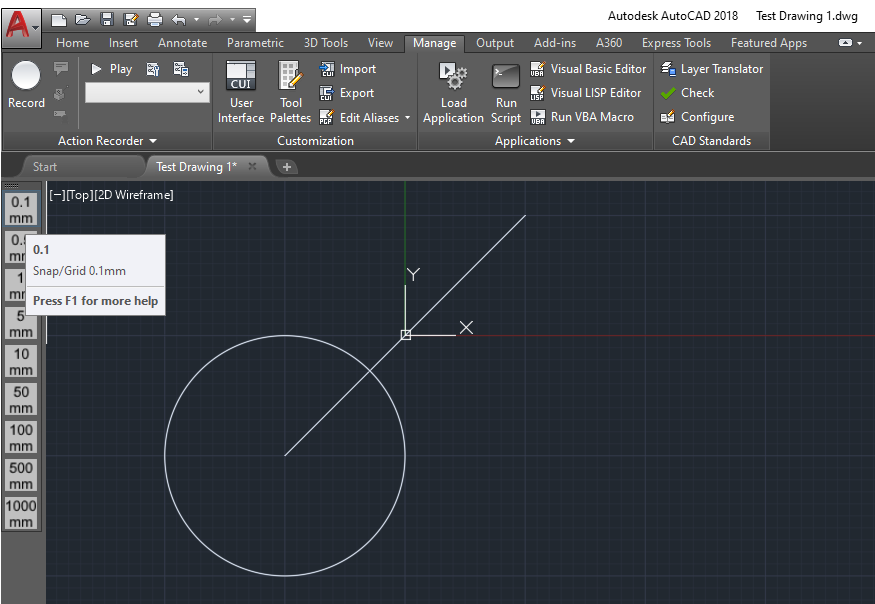

# Grid Snap Toolbar
###### [Overview](./README.md) \- [Object Model](./GridSnapToolbar/Docs/ObjectModel.md)  
## Features
This extension adds a toolbar to AutoCAD named GridSnap. It contains nine buttons on the toolbar.
Each button will change both the grid and snap settings to the measurement on the toolbar button for both the snap as well as the grid.

It will also set the major grid to 10 for 0.1mm, 1mm, 10mm, 100mm, 1000mm or it will set the major grid to 20 for 0.5mm, 5mm, 50mm, 500mm.

## Getting Started

Copy the GridSnapToolbar.dll file and the image files to AutoCAD's support directory. For example:

    C:\Program Files\Autodesk\AutoCAD 2018\Support

To load the extension manually, use the `NETLOAD` command in the console and a dialog window will open up where you can choose the extension.
To automatically load the extension each time you start AutoCAD then copy the acad.lsp file into the support directory as well. 
This will execute the `NETLOAD` command automatically when AutoCAD starts.

## License

MIT License.